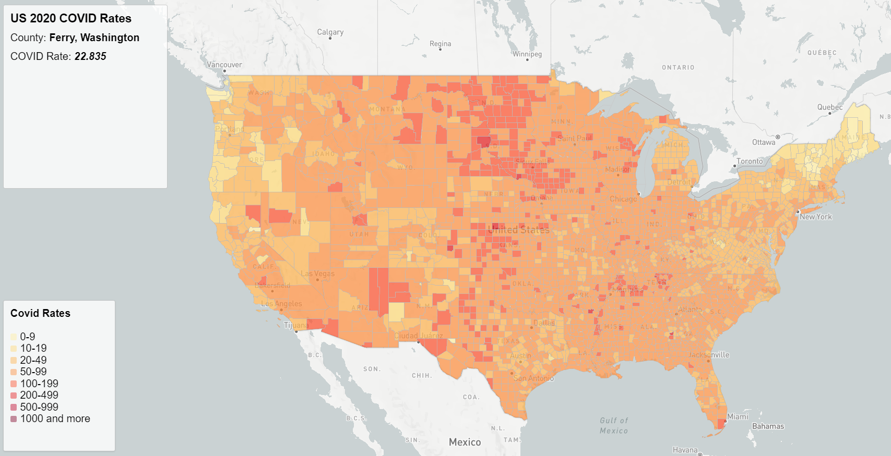
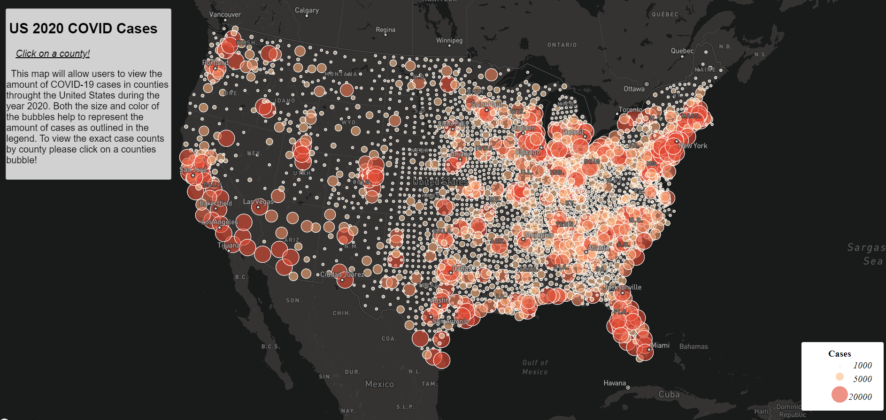

# US COVID 2020 Data Mapping
### By: Hudson Potts
### 4/27/2022

#### Brief Introduction

This project looks at geojson data that covers the COVID-19 pandemic during the year 2020 within the United States. 2 maps have been created to help visualize the data that was collected. Map 1 takes a look at COVID rates, while Map 2 looks at COVID cases. The case rate is based on cases per 1000 residents. Both look at the data from a county level and help us gain a better overall understanding of how the COVID pandemic impacted the country as a whole, and specific regions, counties, and cities. Hopefully the maps are useful in capturing data from a year that will be studied for many years to come.

#### Primary Functions

To allow users an interactive visual map experience, that provides them geographical insights about the COVID-19 pandemic during the year 2020 in the United States.

#### Data Sources

The COVID-19 case/death data is originally from The New York Times. The data includes all the cases in 2020. The population data used for calculating the case rates are from the 2018 ACS 5 year estimates. The U.S. county boundary shapefile was downloaded from the U.S. Census Bureau.

#### Credit/acknowledgment

Mapbox.com, U.S. Census Bureau, The New York Times, Steven Bao, Bo Zhao

##### Map1:

##### Map 2:

[Map 1 Link](https://hudsop2.github.io/geo458lab3covid19/map1.html)
[Map 2 Link](https://hudsop2.github.io/geo458lab3covid19/map2.html)
